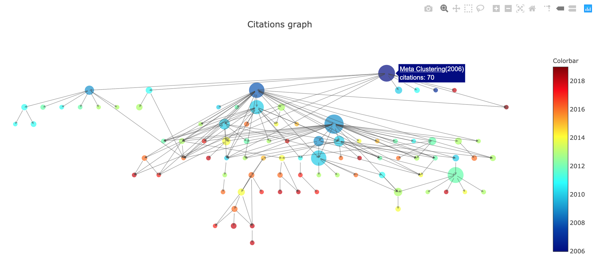

# Citations (alpha)


[Example](docs/meta_clustering_example.html)


## Overview
Citations is a research tool used to visualize a research field as a DAG (Directed acyclic graph). This can be useful when trying to get familiar with a new research field.

The tool is in alpha version, so expect bugs and incompatabilities. *Issues and contributions are highly welcome.*

The tool uses [Semantic Scholar API](https://api.semanticscholar.org/) to get paper information, and creates a DAG out of the citations by recursively getting information on the cited papers. The papers are sorted from most cited (biggest) to least cited (smallest) and from oldest (blue) to newest (red). As default, the tool is showing only the most influential citations (according to Semantic Scholar's "highly influential" attribute) in order to make the graph more compact, but this filter can be disabled.

Some ideas on things to look at:
* The most impactful papers- look for the largest nodes in the graph.
* Newest papers- look for the red nodes.
* Trending papers- look for the largest red nodes.


## Requirements
* Python 3.6+
* Mac OSX, Linux (Windows has not been tested yet)


## Install
This is not a package yet, so we use it as a script.

```
virtualenv --python=python3.6 .venv
source .venv/bin/activate
pip install -r requirements.txt
```

## Usage
The first use on a specific paper might take a while (even 20 minutes for very popular fields with many citations). However, The GET responses are cached locally, so that running the tool again on the same paper and the same computer will be much faster.

For example let's make a graph starting from the paper ["Meta clustering"](https://www.semanticscholar.org/paper/Meta-Clustering-Caruana-Elhawary/4127d83c9eef22918f16a7477ca6e60734c87d8b)

1. We get the Semantic Scholar id from the url: 4127d83c9eef22918f16a7477ca6e60734c87d8b
2. We use the graph.py script to create the graph from the paper's id, and scan 5 citation-levels deep:
```
python graph.py -id 4127d83c9eef22918f16a7477ca6e60734c87d8b -d 5
```

For more arguments:
```
python graph.py --help
```
